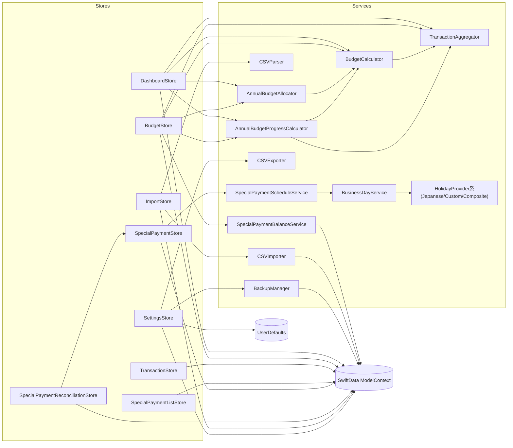

# Store/Service依存関係メモ

## ハイライト
- すべてのStoreが`ModelContext`を直接保持しており、Persistenceへの生接続が集約ポイントになっている。
- 取引/予算系のStore（Dashboard・Budget）は`TransactionAggregator → BudgetCalculator → AnnualBudgetAllocator/ProgressCalculator`という同じ計算チェーンを個別に生成している。
- 特別支払い系は`SpecialPaymentStore`を中心に`SpecialPaymentReconciliationStore`・`BudgetStore`・`SpecialPaymentListStore`が読取/更新しており、スケジューリングは`SpecialPaymentScheduleService → BusinessDayService → HolidayProvider`に依存する。
- インポート/設定系のStoreは外部I/Oサービス（CSVImporter/BackupManagerなど）を直接newしているため、UIフローから永続化/ファイル操作層まで一直線になっている。

## Mermaid図

## 依存ごとの判断とメモ
| Consumer | Dependency | 種別 | 判断 | メモ / インターフェース案 |
| --- | --- | --- | --- | --- |
| DashboardStore | ModelContext | Persistence | Phase2で分離 | クエリ/集計を`TransactionQueryService`(protocol)へ委譲してUI層からSwiftData APIを隠す。|
| DashboardStore | TransactionAggregator / BudgetCalculator / AnnualBudgetAllocator / AnnualBudgetProgressCalculator | Calculator | 残す(インジェクション化) | 共通の`BudgetAnalyticsService`をDIできるようにしてテスト容易性を確保。|
| BudgetStore | SpecialPaymentBalanceService | Service | Phase1で分離 | 未使用だがストアが残高サービスを生成しており、積立照会専用の`SpecialPaymentBalanceProviding`をStore間共有する。|
| BudgetStore | TransactionAggregator / BudgetCalculator / 年次計算器 | Calculator | 残す(インジェクション化) | DashboardStoreと同じチェーンを共有サービスへ寄せて重複ロジックを解消。|
| SpecialPaymentStore | SpecialPaymentScheduleService | Service | 残す | 日付調整ポリシーを差し替え可能にすることで拡張性を担保。|
| SpecialPaymentReconciliationStore | SpecialPaymentStore | Store | Phase1で分離 | 完了/同期処理だけを提供する`SpecialPaymentOccurrencesService`プロトコルを介し、直接Store生成を避ける。|
| SpecialPaymentReconciliationStore | ModelContext | Persistence | Phase2で分離 | Occurrence/Transactionフェッチを`SpecialPaymentReadRepository`へ集約し、副作用をサービスに押し出す。|
| ImportStore | CSVImporter / CSVParser | Service | 残す(インジェクション化) | 現行のままでも良いが、テスト用にプロトコル化してスタブを差し替えられるようにする。|
| SettingsStore | BackupManager | Service | Phase2で分離 | UIから直接ModelContext全削除するのは危険。`BackupService`をActor化して非同期実行に切り出す。|
| SettingsStore | CSVExporter / UserDefaults | Service/System | 残す | 設定の保存/エクスポートはUI層の責務に近く、インターフェース化のみで十分。|

## Phase別アクション
### Phase 1 (結合リスクが高い箇所)
1. `SpecialPaymentReconciliationStore`と`SpecialPaymentStore`の間に`SpecialPaymentOccurrencesService`(完了/同期/解除API)を挟み、UIストアから他ストアをnewしないようにする。
2. `BudgetStore`専用の積立参照処理を`SpecialPaymentBalanceProviding`（定義ごとの積立状況取得）に切り出し、計算だけをUIストアから呼ぶ。
3. Storeが直接サービスをnewしている箇所（Calculator/Importerなど）を引数インジェクション化し、DIしやすい形に揃える。

### Phase 2 (段階的な層分離)
1. `ModelContext`の直接利用を`TransactionRepository`や`BudgetRepository`に委譲し、SwiftDataの差し替えを容易にする。
2. 取引/予算集計を`BudgetAnalyticsService`としてまとめ、Dashboard/Budget双方から共有。集計条件の一元管理とテスト簡素化が狙い。
3. `BackupManager`・`CSVImporter`などI/O重めのサービスをActor/async APIへ昇格させ、UIストアはコマンド発行のみ行う。
4. `SpecialPaymentScheduleService`のBusinessDay依存をDI経由で差し替え、祝日計算を別モジュールに切り離す準備を行う。
